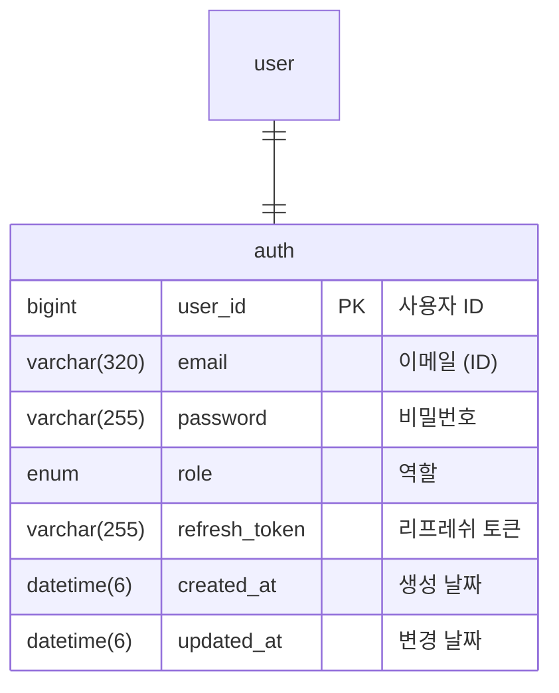
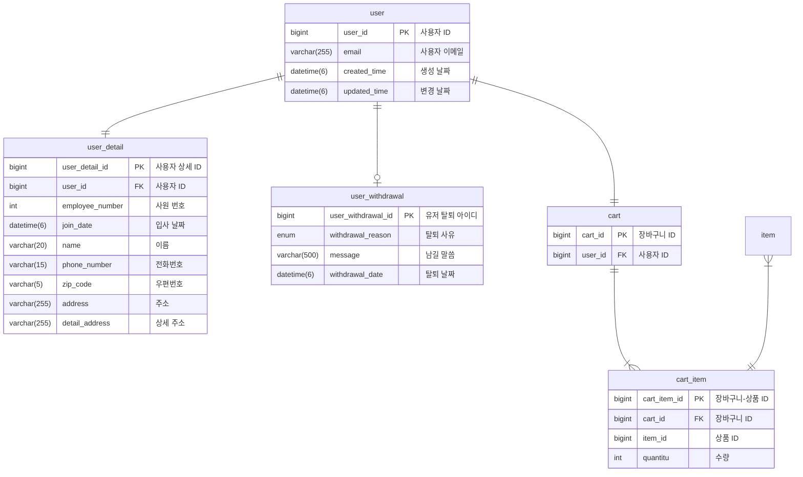
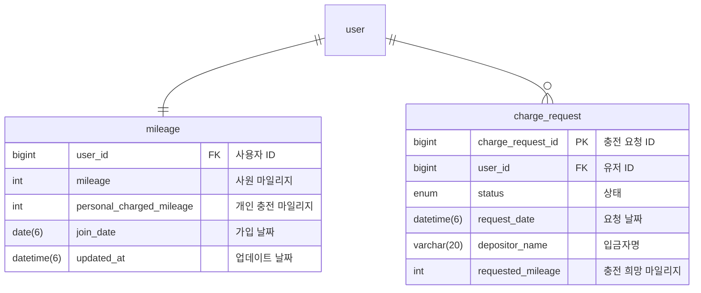
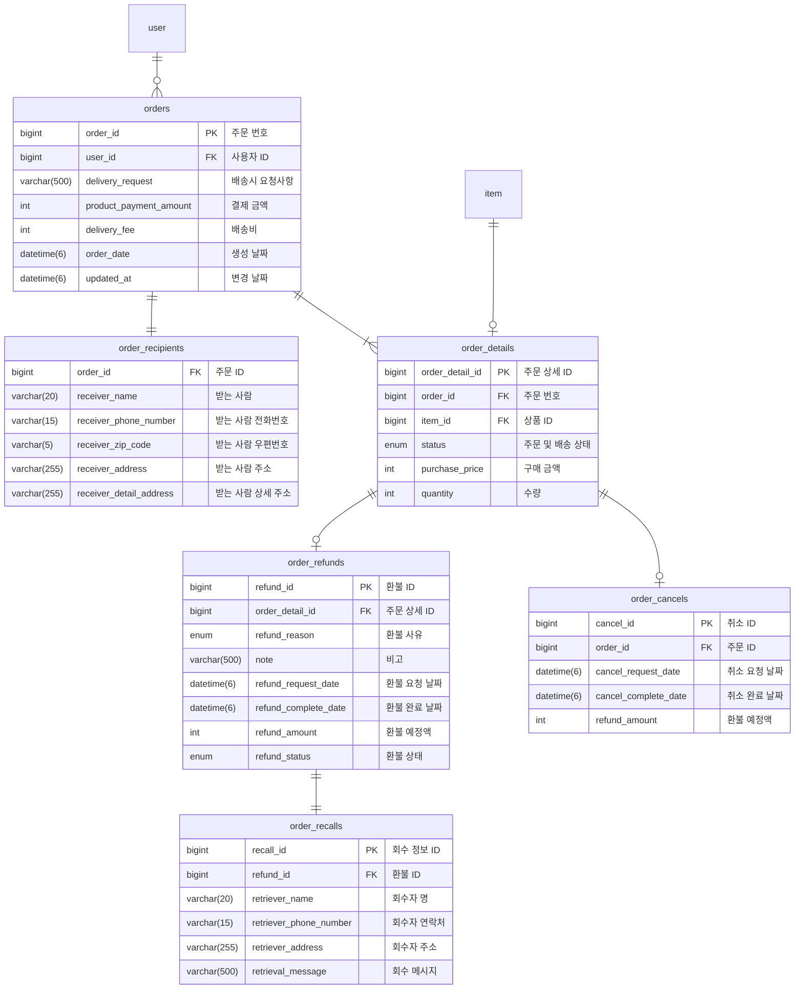
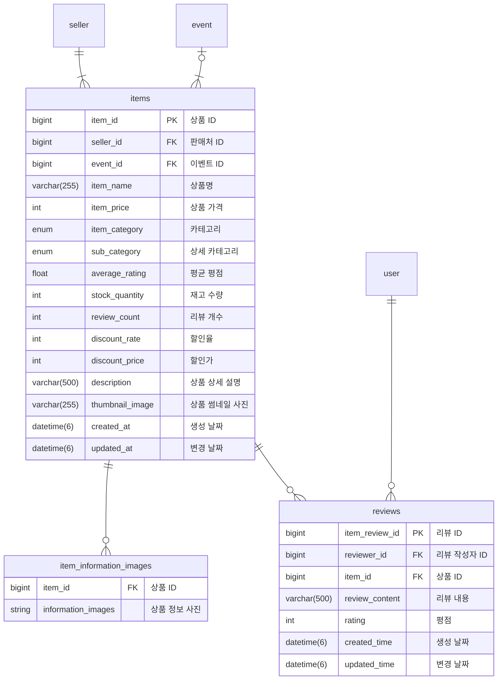
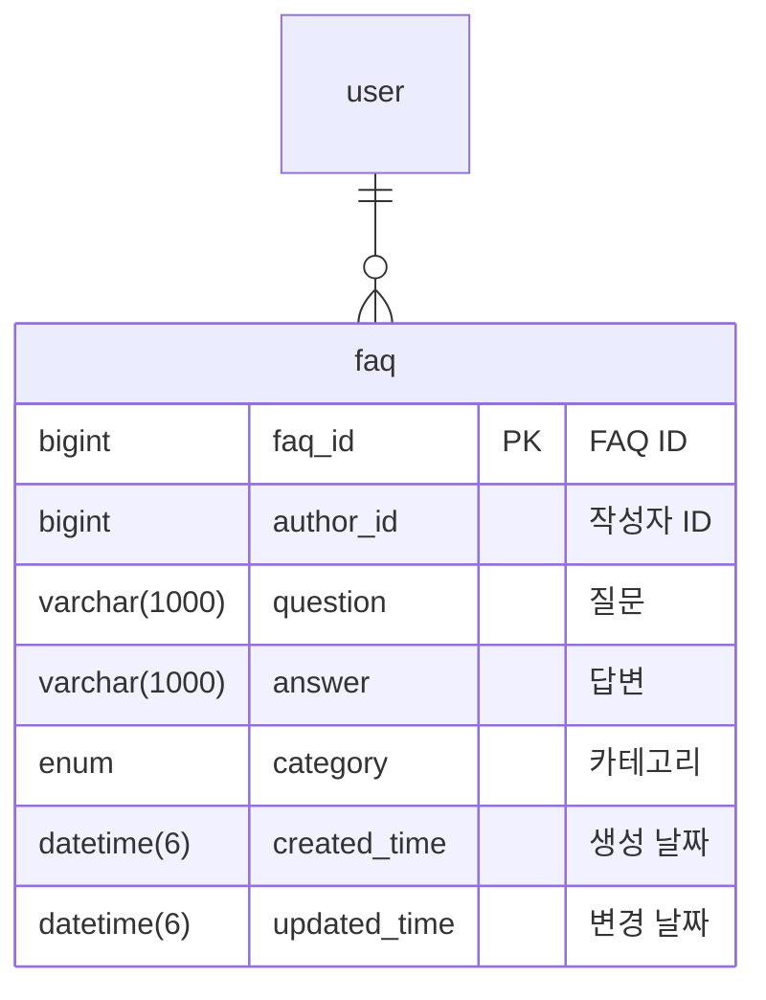
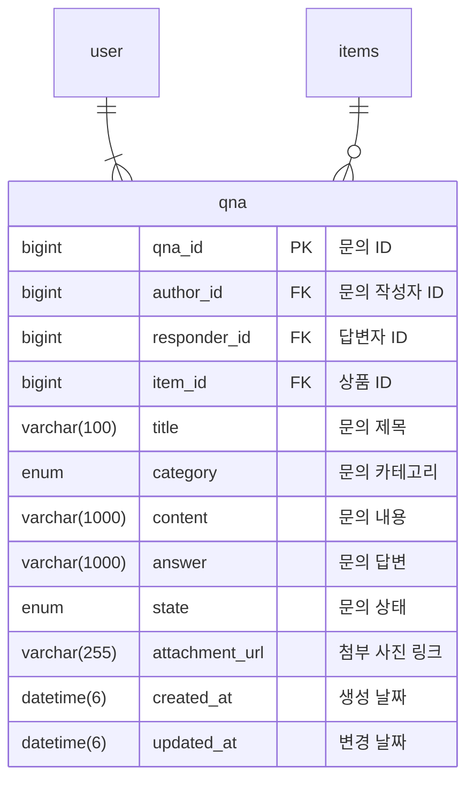
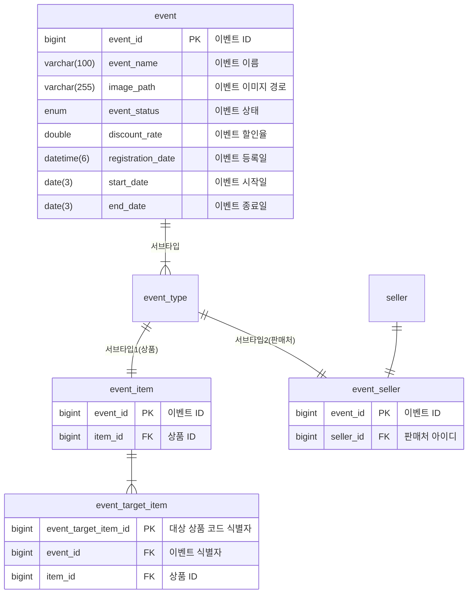
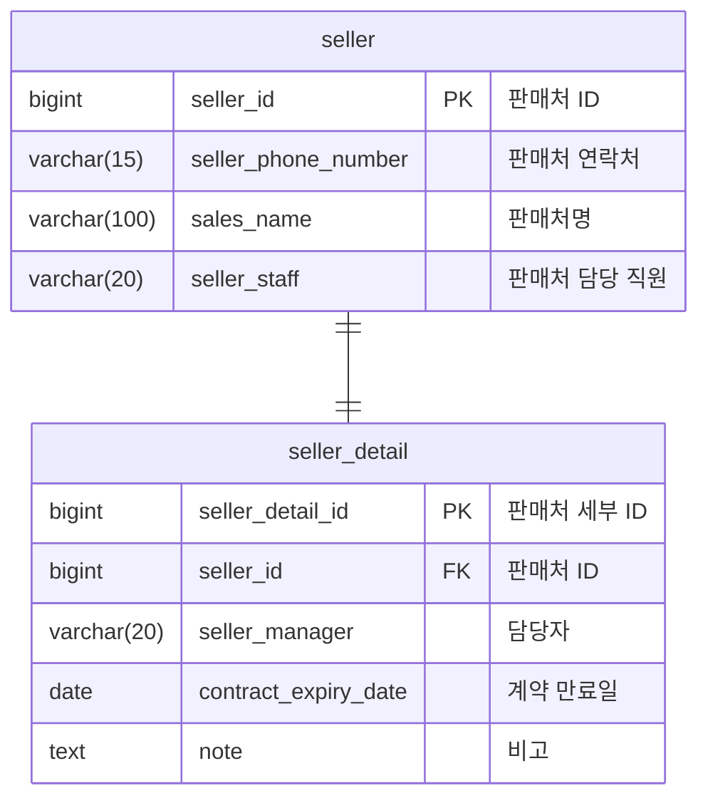

## 인증 서비스

- **role**
    * 1: user
    * 2: admin
    * 3: super_admin

## 사용자 서비스

- **탈퇴 사유**
    * 1: 고객서비스 불만
    * 2: 배송 불만
    * 3: 환불 정책 불만
    * 4: 방문 빈도 낮음
    * 5: 상품 가격 불만
    * 6: 개인 정보 유출 우려
    * 7: 신뢰도 불만
    * 8: 퇴사

## 마일리지 서비스

- **상태**
    * 1: 요청
    * 2: 승인
    * 3: 반려

## 주문 서비스

- **주문 및 배송 상태**
    * 1: 결제 완료
    * 2: 배송 요청
    * 3: 배송 준비중
    * 4: 배송중
    * 5: 배송 완료

- **환불 사유**
    * 1: 사이즈 안 맞음
    * 2: 단순 변심
    * 3: 제품 불만족
    * 4: 배송 지연
    * 5: 제품 오배송
    * 6: 기타

- **환불 상태**
    * 1: 반품 요청
    * 2: 회수중
    * 3: 반품 완료

## 상품 서비스

- **카테고리**
    * 1: 패션
    * 2: 뷰티
    * 3: 스포츠/레저
    * 4: 디지털/가전
    * 5: 인테리어
    * 6: 출산/유아동
    * 7: 생활

- **상세 카테고리**
    * 1: 여성의류
    * 2: 남성의류
    * 3: 언더웨어
    * 4: 신발
    * 5: 가방/지갑/잡화
    * 6: 쥬얼리/시계/액세서리

## FAQ 서비스

- **문의 카테고리**
    * 1: 자주 찾는 FAQ
    * 2: 배송
    * 3: 취소/교환/환불
    * 4: 결제
    * 5: 회원
    * 6: 기타

## 1:1 문의 서비스

- **문의 카테고리**
    * 1: 상품 문의
    * 2: 회원 정보
    * 3: 상품 확인
    * 4: 배송
    * 5: 교환/취소
    * 6: 기타

- **문의 상태**
    * 1: 처리 중
    * 2: 완료 상태

- **공개 여부**
    * 1: true
    * 2: false

## 이벤트 서비스

- **이벤트 상태**
    * 1: 진행중
    * 2: 종료

- **이벤트 종류**
    * 1: 상품
    * 2: 판매처

## 판매처 서비스

