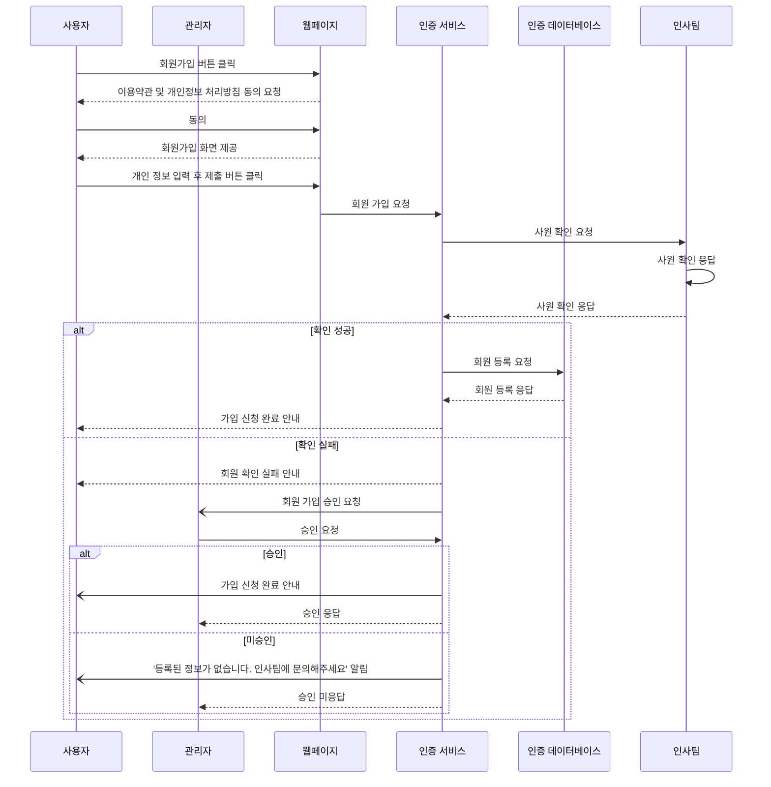

# 요구사항 1번) 회원가입

1. 직원 확인용으로 사원번호, 아이디(회사 이메일), 비밀번호, 이름, 입사일 적고 회원가입 신청
    - (관리자) 회원가입 신청하면 인사팀에서 가지고 있는 데이터와 위의 사원번호와 입사일을 대조하여 직원 확인 후 회원가입 승인
    - 비밀번호 8자 이상 / 대문자 + 소문자 + 특수문자 포함
    - 60일마다 비밀번호 갱신 요청
2. 개인 정보 입력 : 간단한 개인 정보들로 편리하게 가입할 수 있도록 함
3. 이용약관 및 개인정보 처리방침 동의
4. 가입 신청 완료 안내 화면 표시
    - 가입 실패시 '등록된 정보가 없습니다. 인사팀에 문의해주세요'라는 알림창이 뜬다.

