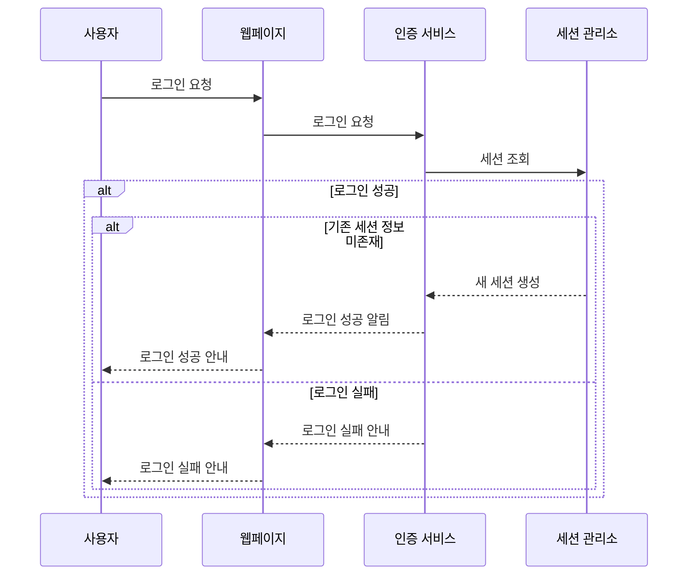

# 요구사항 2번) 로그인

1. 아이디 및 비밀번호 입력
2. 로그인 실패 안내
3. 로그아웃 (버튼 및 로그아웃 안내)
4. 세션 유지 및 만료 : 로그인 상태가 유지되는 기간 및 세선 만료 시 자동 로그아웃 설정

```mermaid
sequenceDiagram
    participant User as 사용자
    participant WebPage as 웹페이지
    participant AuthService as 인증 서비스
    participant SessionRepository as 세션 관리소
    
    User ->> WebPage: 로그인 요청
    WebPage ->> AuthService: 로그인 요청
    AuthService ->> SessionRepository: 세션 조회

    alt 로그인 성공
        alt 기존 세션 정보 미존재
            SessionRepository -->> AuthService: 새 세션 생성
            AuthService -->> WebPage: 로그인 성공 알림
            WebPage -->> User: 로그인 성공 안내

%%        else 기존 세션 정보 존재
%%            SessionRepository -->> AuthService: 기존 세션 반환
%%            AuthService -->> WebPage: 중복 로그인 오류
%%            WebPage -->> User: 이미 다른 기기에서 로그인됨 안내
%%
%%            alt 사용자가 기존 세션 로그아웃 선택
%%                User ->> WebPage: 기존 세션 로그아웃 동의
%%                WebPage ->> AuthService: 기존 세션 로그아웃 요청
%%                AuthService ->> SessionRepository: 기존 세션 삭제
%%                SessionRepository -->> AuthService: 세션 삭제 완료
%%                AuthService -->> WebPage: 새 로그인 진행
%%                WebPage -->> User: 새로운 로그인 성공 안내
%%
%%            else 사용자가 로그아웃 거부
%%                User ->> WebPage: 기존 세션 유지 선택
%%                WebPage -->> User: 기존 로그인 유지 안내
%%            end

        else 로그인 실패
            AuthService -->> WebPage: 로그인 실패 안내
            WebPage -->> User: 로그인 실패 안내
        end
    end
```