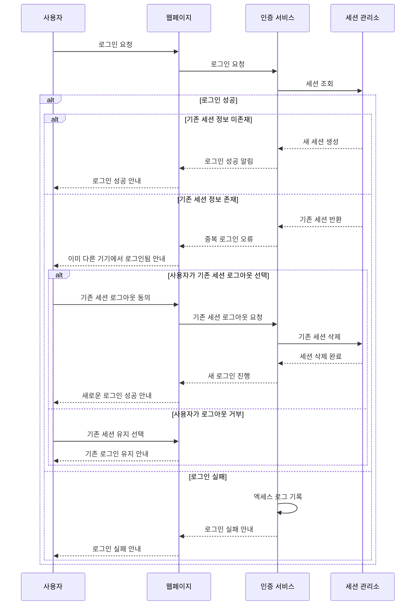

# 요구사항 2번) 로그인

1. 아이디 및 비밀번호 입력 (+ 자동 로그인 옵션)
2. 로그인 실패 안내
3. 세션 유지 및 만료 : 로그인 상태가 유지되는 기간 및 세선 만료 시 자동 로그아웃 설정
    - 중복 로그인 방지 : 동일한 세선 ID로 여러 사용자가 로그인하는 것을 방지하기 위해, 서버에서는 이미 사용 중인 세션 ID를 확인하고 중복 로그인 방지
    - 엑세스 로그 관리 : 중복 로그인 시도 또는 다중 기기에서의 로그인 시도 등에 대한 로그를 기록하여 보안 관리 및 감지에 활용

