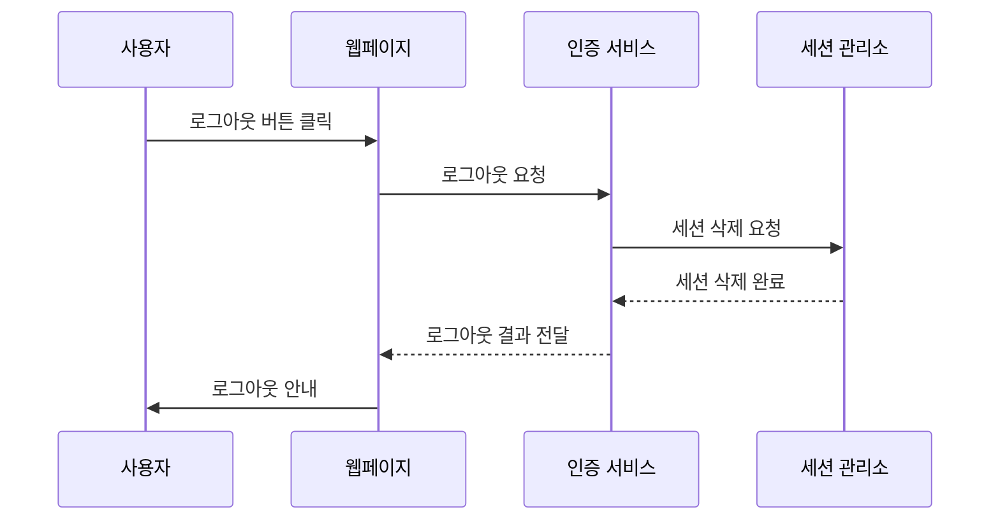

# 요구사항 3번) 로그아웃

1. 로그아웃 (버튼 및 로그아웃 안내)
    - 세션 만료 시간은 '1시간'으로 한다.

```mermaid
sequenceDiagram
    participant User as 사용자
    participant WebPage as 웹페이지
    participant AuthService as 인증 서비스
    participant SessionRepository as 세션 관리소
    User ->> WebPage: 로그아웃 버튼 클릭
    WebPage ->> AuthService: 로그아웃 요청
    AuthService ->> SessionRepository: 세션 삭제 요청
    SessionRepository -->> AuthService: 세션 삭제 완료
    AuthService -->> WebPage: 로그아웃 결과 전달
    WebPage ->> User: 로그아웃 안내

```

## 참고 
1. [세션 연장 및 자동 로그아웃](Req_05.md)