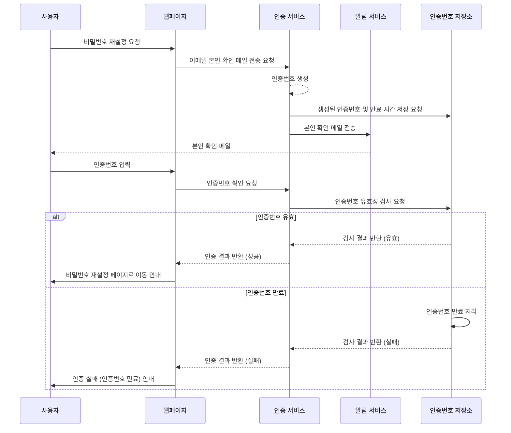

# 요구사항 4번) 비밀번호 찾기

1. 이메일로 본인 확인 메일 전송
2. 이메일로 받은 인증번호로 인증할 시, 비밀번호 재설정으로 이동
    - 인증번호는 자연수 4자리, 5분 동안 유효.

```mermaid
sequenceDiagram
    participant User as 사용자
    participant System as 웹페이지
    participant Server as 인증 서비스
    participant NotificationService as 알림 서비스
    participant AuthStore as 인증번호 저장소
    
    User ->> System: 비밀번호 재설정 요청
    System ->> Server: 이메일 본인 확인 메일 전송 요청
    Server -->> Server: 인증번호 생성
    Server ->> AuthStore: 생성된 인증번호 및 만료 시간 저장 요청
    Server ->> NotificationService: 본인 확인 메일 전송
    NotificationService -->> User: 본인 확인 메일
    User ->> System: 인증번호 입력
    System ->> Server: 인증번호 확인 요청
    Server ->> AuthStore: 인증번호 유효성 검사 요청

    alt 인증번호 유효
        AuthStore -->> Server: 검사 결과 반환 (유효)
        Server -->> System: 인증 결과 반환 (성공)
        System ->> User: 비밀번호 재설정 페이지로 이동 안내

    else 인증번호 만료
        AuthStore ->> AuthStore: 인증번호 만료 처리
        AuthStore -->> Server: 검사 결과 반환 (실패)
        Server -->> System: 인증 결과 반환 (실패)
        System ->> User: 인증 실패 (인증번호 만료) 안내
    end

```