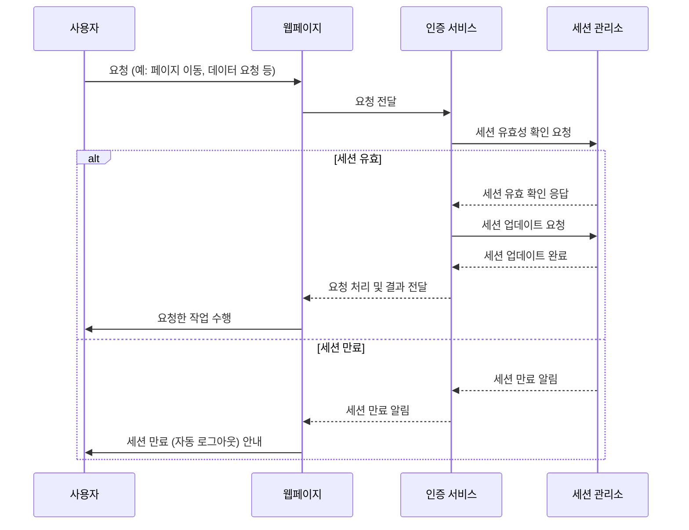

# 요구사항 5번) 세션 연장

1. 보다 더 나은 사용자 경험을 위해 자동으로 세션을 연장한다.

```mermaid
sequenceDiagram
    participant User as 사용자
    participant WebPage as 웹페이지
    participant AuthService as 인증 서비스
    participant SessionRepository as 세션 관리소
    
    User ->> WebPage: 요청 (예: 페이지 이동, 데이터 요청 등)
    WebPage ->> AuthService: 요청 전달
    AuthService ->> SessionRepository: 세션 유효성 확인 요청

    alt 세션 유효
        SessionRepository -->> AuthService: 세션 유효 확인 응답
        AuthService ->> SessionRepository: 세션 업데이트 요청
        SessionRepository -->> AuthService: 세션 업데이트 완료
        AuthService -->> WebPage: 요청 처리 및 결과 전달
        WebPage ->> User: 요청한 작업 수행
    else 세션 만료
        SessionRepository -->> AuthService: 세션 만료 알림
        AuthService -->> WebPage: 세션 만료 알림
        WebPage ->> User: 세션 만료 (자동 로그아웃) 안내
    end

```
