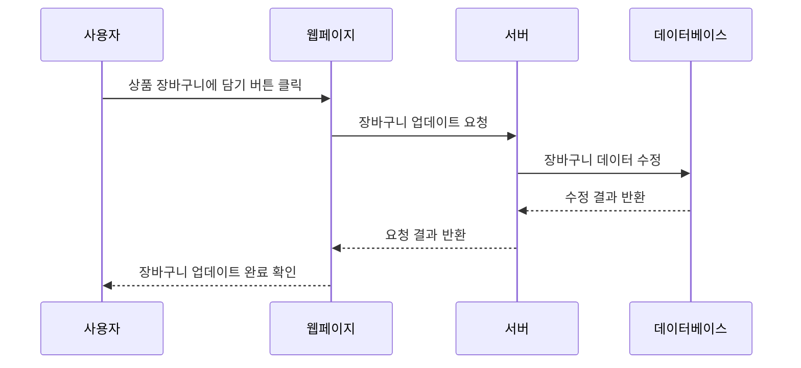

# 요구사항 1번) 장바구니 담기

1. 사용자는 상품을 장바구니에 담아두고 필요할 때 언제든지 확인할 수 있어야 한다.

```mermaid
sequenceDiagram
    participant User as 사용자
    participant WebPage as 웹페이지
    participant Server as 서버
    participant Database as 데이터베이스

    User ->> WebPage: 상품 장바구니에 담기 버튼 클릭
    WebPage ->> Server: 장바구니 업데이트 요청
    Server ->> Database: 장바구니 데이터 수정
    Database -->> Server: 수정 결과 반환
    Server -->> WebPage: 요청 결과 반환
    WebPage -->> User: 장바구니 업데이트 완료 확인
```