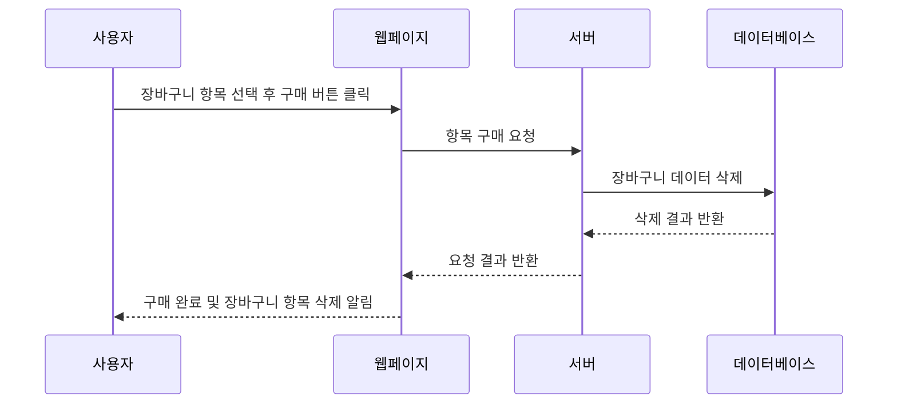

# 요구사항 3번) 장바구니 구매

1. 사용자는 장바구니에 있는 항목을 선택하여 구매할 수 있어야 하며, 구매한 항목은 장바구니에서 제거된다.

```mermaid
sequenceDiagram
    participant User as 사용자
    participant WebPage as 웹페이지
    participant Server as 서버
    participant Database as 데이터베이스

    User ->> WebPage: 장바구니 항목 선택 후 구매 버튼 클릭
    WebPage ->> Server: 항목 구매 요청
    Server ->> Database: 장바구니 데이터 삭제
    Database -->> Server: 삭제 결과 반환
    Server -->> WebPage: 요청 결과 반환
    WebPage -->> User: 구매 완료 및 장바구니 항목 삭제 알림
```