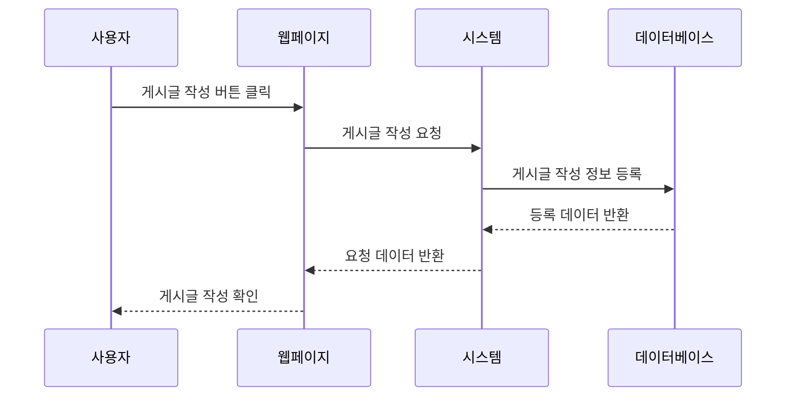

# 요구사항 1번) 게시글 작성

1. 게시글 작성
    - (사용자) 고객 문의 작성
    - (관리자) FAQ 작성
    - (관리자) 고객 문의 답글 작성
    - (관리자) 상품 문의 답글 작성(cf:Req_07,Req_08,Req_09,Req_10)
    - (관리자) 마일리지 사용법 작성

```mermaid
sequenceDiagram
   participant User as 사용자
   participant Webpage as 웹페이지
   participant System as 시스템
   participant Database as 데이터베이스

   User->>Webpage: 게시글 작성 버튼 클릭
   Webpage->>System: 게시글 작성 요청
   System->>Database: 게시글 작성 정보 등록
   Database-->>System: 등록 데이터 반환
   System-->>Webpage: 요청 데이터 반환
   Webpage-->>User: 게시글 작성 확인
```