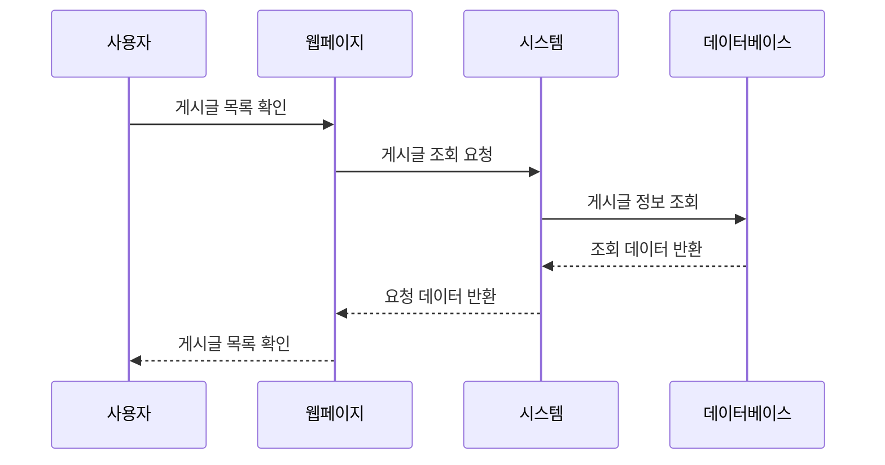

# 요구사항 2번) 게시글 조회

1. 게시글 조회
    - (사용자) 고객 문의 조회(본인 것만)
    - (사용자) FAQ 조회
    - (사용자) 마일리지 사용 방법 조회
    - (관리자) 고객 문의 조회
    - (관리자) 상품 문의 조회
    - (관리자) FAQ 조회

```mermaid
sequenceDiagram
   participant User as 사용자
   participant Webpage as 웹페이지
   participant System as 시스템
   participant Database as 데이터베이스

   User->>Webpage: 게시글 목록 확인
   Webpage->>System: 게시글 조회 요청
   System->>Database: 게시글 정보 조회
   Database-->>System: 조회 데이터 반환
   System-->>Webpage: 요청 데이터 반환
   Webpage-->>User: 게시글 목록 확인
```