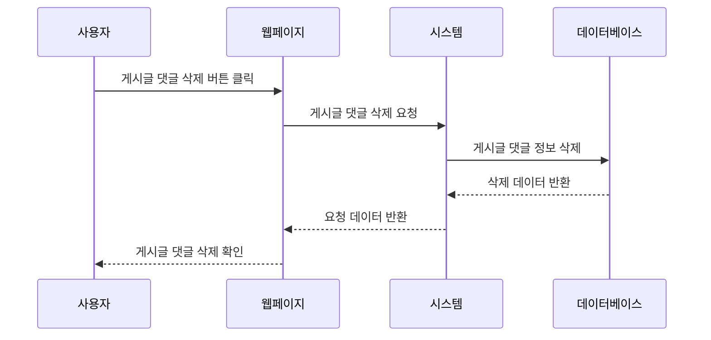

# 요구사항 7번) 게시글 댓글 삭제

1. 게시글 답변 작성
    - (사용자) 고객 문의 답변의 댓글 삭제 - 관리자가 댓글 작성하기 이전(before)

```mermaid
sequenceDiagram
   participant User as 사용자
   participant Webpage as 웹페이지
   participant System as 시스템
   participant Database as 데이터베이스

   User->>Webpage: 게시글 댓글 삭제 버튼 클릭
   Webpage->>System: 게시글 댓글 삭제 요청
   System->>Database: 게시글 댓글 정보 삭제
   Database-->>System: 삭제 데이터 반환
   System-->>Webpage: 요청 데이터 반환
   Webpage-->>User: 게시글 댓글 삭제 확인
```