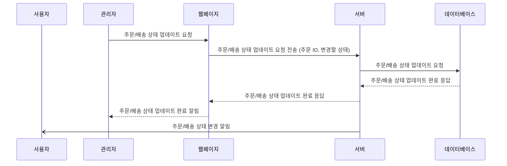

# 요구사항 1번) 주문 및 배송 상태 업데이트

1. 주문 및 배송 상태 업데이트
    - 주문 및 배송 단계
        - 결제 완료
        - 배송 요청
        - 배송 준비 중
        - 배송 중
        - 배송 완료

```mermaid
sequenceDiagram
   participant User as 사용자
   participant Admin as 관리자
   participant WebPage as 웹페이지
   participant Server as 서버
   participant Database as 데이터베이스

   Admin ->> WebPage: 주문/배송 상태 업데이트 요청
   WebPage ->> Server: 주문/배송 상태 업데이트 요청 전송 (주문 ID, 변경할 상태)
   Server ->> Database: 주문/배송 상태 업데이트 요청
   Database -->> Server: 주문/배송 상태 업데이트 완료 응답
   Server -->> WebPage: 주문/배송 상태 업데이트 완료 응답
   WebPage -->> Admin: 주문/배송 상태 업데이트 완료 알림
   Server -) User: 주문/배송 상태 변경 알림

```