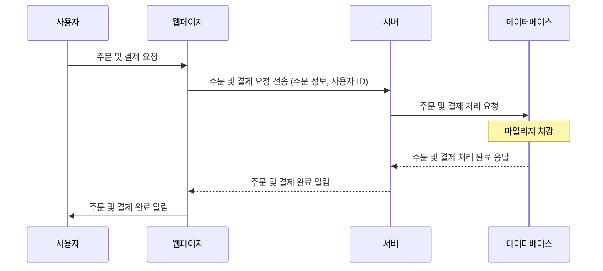

# 요구사항 2번) 주문 프로세스

1. 사원 마일리지를 이용해서 주문
2. 간편한 주문 절차를 통해 결제(사원 마일리지 차감)까지 완료할 수 있어야 함

```mermaid
sequenceDiagram
    participant User as 사용자
    participant WebPage as 웹페이지
    participant Server as 서버
    participant Database as 데이터베이스
    
    User ->> WebPage: 주문 및 결제 요청
    WebPage ->> Server: 주문 및 결제 요청 전송 (주문 정보, 사용자 ID)
    Server ->> Database: 주문 및 결제 처리 요청
    Note over Database: 마일리지 차감
    Database -->> Server: 주문 및 결제 처리 완료 응답
    Server -->> WebPage: 주문 및 결제 완료 알림
    WebPage ->> User: 주문 및 결제 완료 알림

```