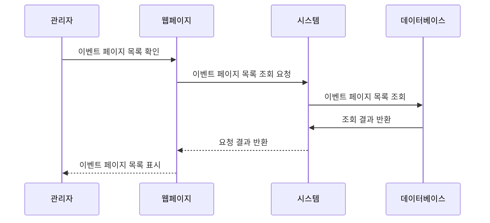

# 요구사항 2번) 이벤트 조회

1. 이벤트 조회

```mermaid
sequenceDiagram
    participant Admin as 관리자
    participant Webpage as 웹페이지
    participant System as 시스템
    participant Database as 데이터베이스

    Admin ->> Webpage: 이벤트 페이지 목록 확인
    Webpage ->> System: 이벤트 페이지 목록 조회 요청
    System ->> Database: 이벤트 페이지 목록 조회
    Database ->> System: 조회 결과 반환
    System -->> Webpage: 요청 결과 반환
    Webpage -->> Admin: 이벤트 페이지 목록 표시
```