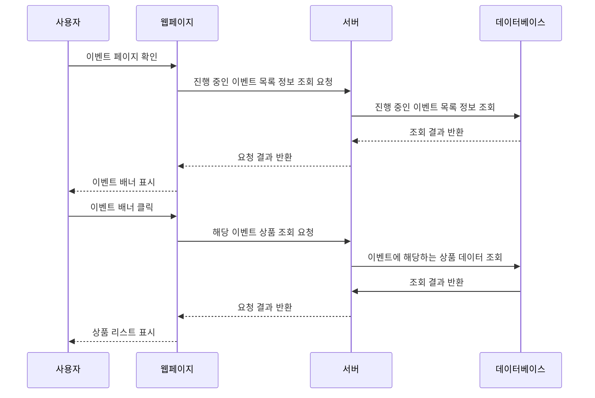

# 요구사항 3번) 이벤트 리스트 조회

1. 쇼핑몰에서 관리자가 등록한 진행중인 이벤트에 대한 정보(이미지) 표시
    - 이벤트 배너를 클릭하면 그 이벤트에 해당하는 상품들 검색 (중요도 하)

```mermaid
sequenceDiagram
   participant User as 사용자
   participant WebPage as 웹페이지
   participant Server as 서버
   participant Database as 데이터베이스

   User ->> WebPage: 이벤트 페이지 확인
   WebPage ->> Server: 진행 중인 이벤트 목록 정보 조회 요청
   Server ->> Database: 진행 중인 이벤트 목록 정보 조회
   Database -->> Server: 조회 결과 반환
   Server -->> WebPage: 요청 결과 반환
   WebPage -->> User: 이벤트 배너 표시

   User ->> WebPage: 이벤트 배너 클릭
   WebPage ->> Server: 해당 이벤트 상품 조회 요청
   Server ->> Database: 이벤트에 해당하는 상품 데이터 조회
   Database ->> Server: 조회 결과 반환
   Server -->> WebPage: 요청 결과 반환
   WebPage -->> User: 상품 리스트 표시
```