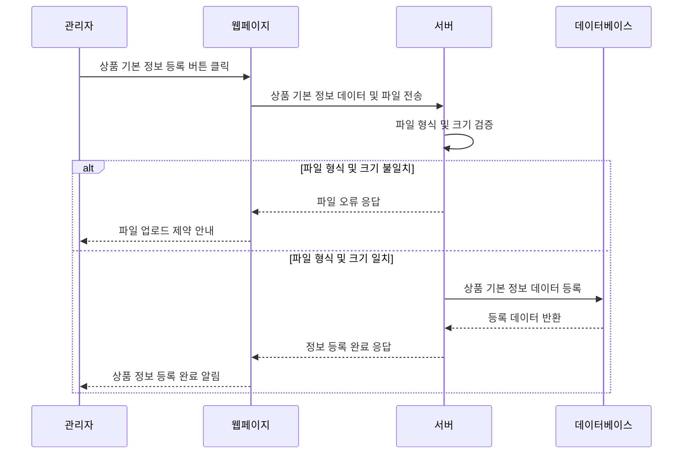

# 요구사항 1번) 상품의 기본 정보 등록

1. 관리자가 상품의 기본 정보를 등록
   - 상품명, 가격, 할인율, 브랜드, 카테고리, 세부 카테고리, 상품 썸네일 이미지, 상품 상세정보 이미지, 태그
   - jpg, png, gif만 업로드 가능 (업로드 파일 제약), 5MB 이하

```mermaid
sequenceDiagram
   participant Admin as 관리자
   participant WebPage as 웹페이지
   participant Server as 서버
   participant Database as 데이터베이스

   Admin ->> WebPage: 상품 기본 정보 등록 버튼 클릭
   WebPage ->> Server: 상품 기본 정보 데이터 및 파일 전송
   Server ->> Server: 파일 형식 및 크기 검증
   alt 파일 형식 및 크기 불일치
      Server -->> WebPage: 파일 오류 응답
      WebPage -->> Admin: 파일 업로드 제약 안내
   else 파일 형식 및 크기 일치
      Server ->> Database: 상품 기본 정보 데이터 등록
      Database -->> Server: 등록 데이터 반환
      Server -->> WebPage: 정보 등록 완료 응답
      WebPage -->> Admin: 상품 정보 등록 완료 알림
   end
```