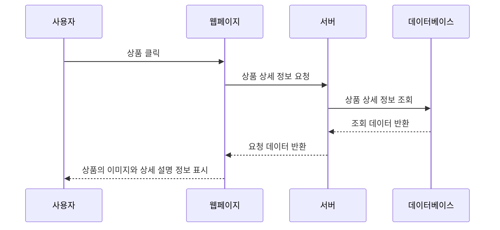

# 요구사항 2번) 상품 이미지 및 상세 설명

1. 상품에 대한 다양한 이미지와 상세한 설명을 한 눈에 확인할 수 있는 정보 제공
    - 상품명
    - 상품 가격
    - 별점 및 리뷰
    - 상품 상세정보

```mermaid
sequenceDiagram
   participant User as 사용자
   participant WebPage as 웹페이지
   participant Server as 서버
   participant Database as 데이터베이스

   User ->> WebPage: 상품 클릭
   WebPage ->> Server: 상품 상세 정보 요청
   Server ->> Database: 상품 상세 정보 조회
   Database -->> Server: 조회 데이터 반환
   Server -->> WebPage: 요청 데이터 반환
   WebPage -->> User: 상품의 이미지와 상세 설명 정보 표시
```