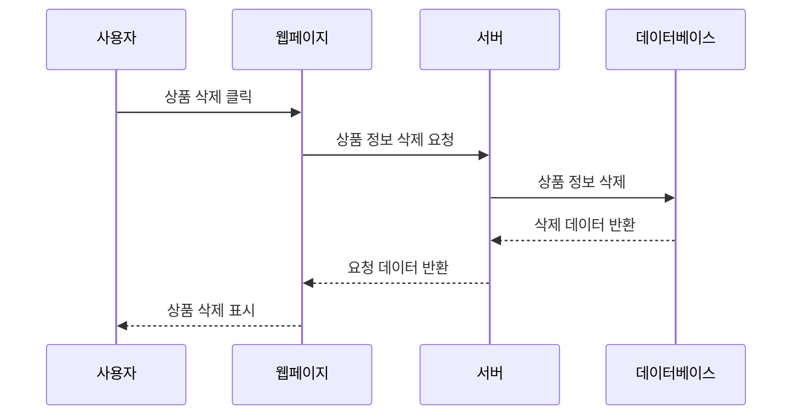

# 요구사항 4번) 상품 삭제

1. 관리자가 쇼핑몰에 등록된 상품 삭제
   - 삭제된 상품은 사용자의 장바구니에서 모두 삭제된다.

```mermaid
sequenceDiagram
   participant User as 사용자
   participant WebPage as 웹페이지
   participant Server as 서버
   participant Database as 데이터베이스

   User ->> WebPage: 상품 삭제 클릭
   WebPage ->> Server: 상품 정보 삭제 요청
   Server ->> Database: 상품 정보 삭제
   Database -->> Server: 삭제 데이터 반환
   Server -->> WebPage: 요청 데이터 반환
   WebPage -->> User: 상품 삭제 표시
```