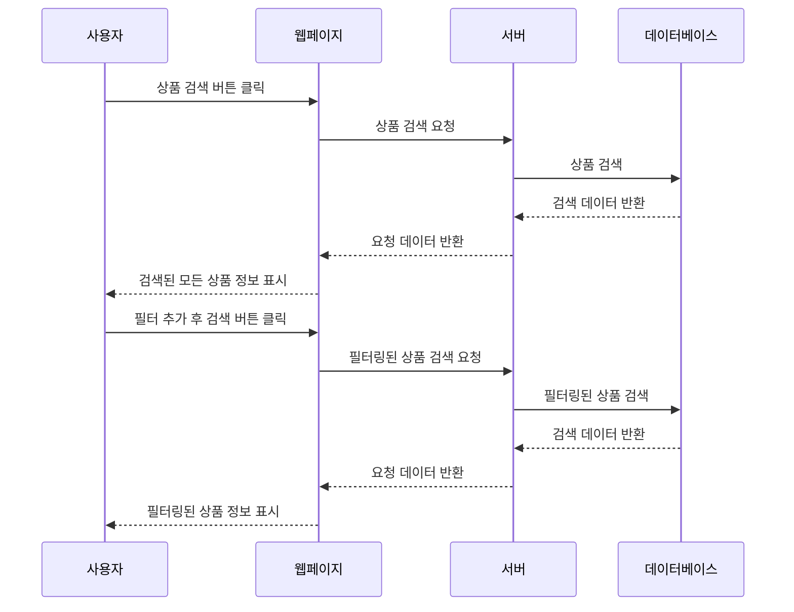

# 요구사항 5번) 상품 정보 조회 및 검색

1. 상품의 기본 정보를 쉽고 편리하게 조회하고 검색
    - 처음 검색 결과로는 검색된 모든 정보 표시
    - 검색 제품에 대해 필터를 추가로 거는 경우 필터링된 결과로 다시 조회
        - 필터는 다중선택 가능(같은 필터에 해당하는 요소들도 다중 선택 가능. 예 : 패션, 식품)
        - 카테고리 / 브랜드 / 가격대 / 혜택
            - 카테고리 : 패션 / 뷰티 / 육아 / 식품 / 스포츠.레저 / 생활 / 디지털.가전 / 인테리어 / 출산.유아동
                - 패션 : 여성의류 / 남성의류 / 언더웨어 / 신발.수제화 / 가방.지갑.잡화 / 쥬얼리.시계.액세서리 / 테마의류.잡화
                - 뷰티 : 스킨케어.메이크업 / 향수.바디.헤어
                - 식품 : 쌀.과일.농축수산물 / 가공식품 / 과자.빵.떡 / 음료.생수.커피 / 홍삼.건강.다이어트식품
                - 스포츠/레저 : 스포츠.의류.운동화.잡화 / 등산.캠핑.낚시 / 구기.헬스.수영.스키 / 골프클럽.의류.용품 / 자전거.인라인.모터사이클
                - 생활 : 생활.제지.잡화 / 욕실.청소.세제 / 주방.식기.용기 / 건강관리.실버용품 / 반려동물.애완용품 / 악기.취미.만들기 / 문구.사무.용지 / 산업.공구.안전용품 /
                  자동차용품 / 도서.음반.DVD
                - 디지털.가전 : 휴대폰.악세서리 / 영상가전.TV.홈시어터 / 카메라.캠코더.주변기기 / 게임.주변기기 / 음향가전.스피커.학습기기 / 노트북.태블릿PC /
                  데스크탑.모니터.PC부품 / 프린터.PC주변.사무기기 / 계절가전.에어컨.온열기기 / 주방가전.냉장고.전기밥솥 / 생활가전.세탁기.청소기 / 이미용.건강.욕실가전 /
                  내비.블랙박스.하이패스
                - 인테리어 : 수납.정리.선반 / 홈.인테리어 / 거실.주방가구 / 침구.커튼.카페트 / 침실가구 / 홈오피스.키즈가구
                - 출산.유아동 : 유아동의류.신발.가방 / 분유.기저귀 / 출산.유아용품 / 임부복
        - 브랜드 : 가나다순
        - 가격대 : 가격대 선택 가능한 스크롤바 UI (간격 : 1만 마일리지, 최소 : 0 마일리지, 최대 : 1000 만 마일리지 )

