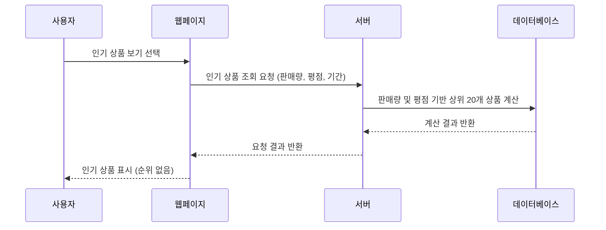

# 요구사항 6번) 인기 상품 표시

1. 인기 상품 표시
    - 판매량, 평점 기준
    - 1일, 1주, 1달 단위로
    - 상위 20개 상품, 순위표시는 하지 않는다

```mermaid
sequenceDiagram
   participant User as 사용자
   participant WebPage as 웹페이지
   participant Server as 서버
   participant Database as 데이터베이스

   User ->> WebPage: 인기 상품 보기 선택
   WebPage ->> Server: 인기 상품 조회 요청 (판매량, 평점, 기간)
   Server ->> Database: 판매량 및 평점 기반 상위 20개 상품 계산
   Database -->> Server: 계산 결과 반환
   Server -->> WebPage: 요청 결과 반환
   WebPage -->> User: 인기 상품 표시 (순위 없음)
```