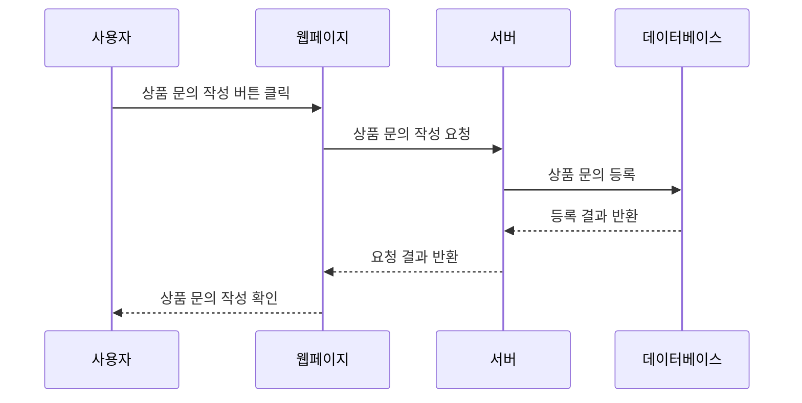

# 요구사항 7번) 상품 문의 작성

1. 사용자는 상품마다 문의글을 남길 수 있다.
2. 상품을 구매하지 않아도 작성할 수 있다.

```mermaid
sequenceDiagram
    participant User as 사용자
    participant WebPage as 웹페이지
    participant Server as 서버
    participant Database as 데이터베이스

    User ->> WebPage: 상품 문의 작성 버튼 클릭
    WebPage ->> Server: 상품 문의 작성 요청
    Server ->> Database: 상품 문의 등록
    Database -->> Server: 등록 결과 반환
    Server -->> WebPage: 요청 결과 반환
    WebPage -->> User: 상품 문의 작성 확인
```