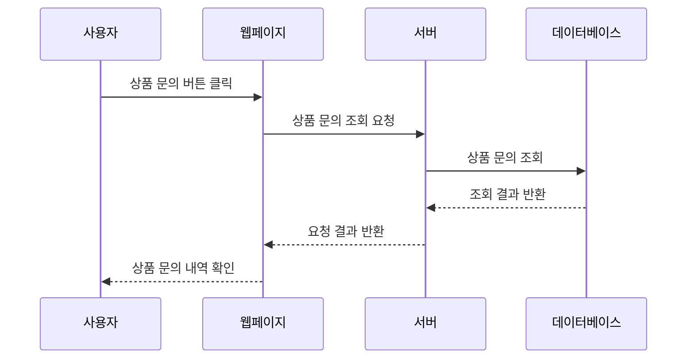

# 요구사항 8번) 상품 문의 조회

1. 사용자는 상품마다 문의 목록을 볼 수 있다.
2. 상품 문의글 목록에는 다른 사용자가 작성한 문의도 포함되어 있고, 다른 사용자의 문의를 볼 수도 있다.
3. 문의는 댓글 없이, 문의글과 답변으로만 이루어져 있다.

```mermaid
sequenceDiagram
    participant User as 사용자
    participant WebPage as 웹페이지
    participant Server as 서버
    participant Database as 데이터베이스

    User ->> WebPage: 상품 문의 버튼 클릭
    WebPage ->> Server: 상품 문의 조회 요청
    Server ->> Database: 상품 문의 조회
    Database -->> Server: 조회 결과 반환
    Server -->> WebPage: 요청 결과 반환
    WebPage -->> User: 상품 문의 내역 확인
```