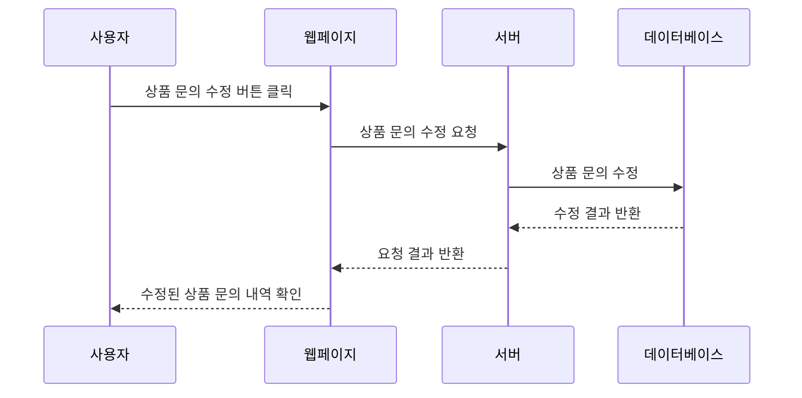

# 요구사항 9번) 상품 문의 수정

1. 사용자는 자신이 작성한 상품 문의글을 수정할 수 있다. - 관리자가 답변을 작성하기 전(before)에 가능

```mermaid
sequenceDiagram
    participant User as 사용자
    participant WebPage as 웹페이지
    participant Server as 서버
    participant Database as 데이터베이스

    User ->> WebPage: 상품 문의 수정 버튼 클릭
    WebPage ->> Server: 상품 문의 수정 요청
    Server ->> Database: 상품 문의 수정
    Database -->> Server: 수정 결과 반환
    Server -->> WebPage: 요청 결과 반환
    WebPage -->> User: 수정된 상품 문의 내역 확인
```