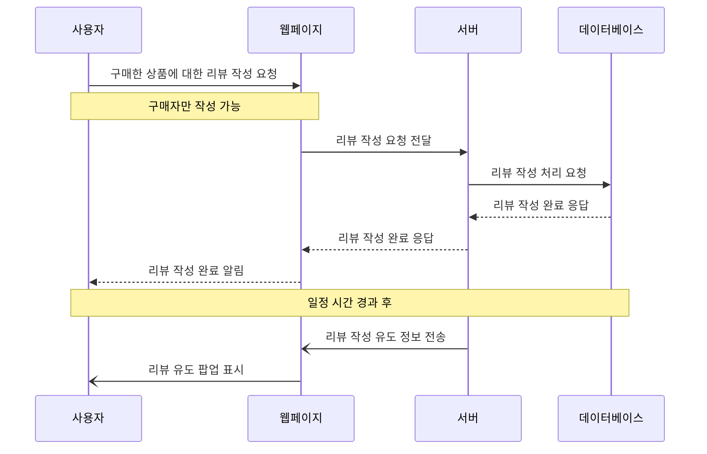

# 요구사항 1번) 상품 리뷰 작성

1. 사용자는 구매한 상품에 대해 별점과 함께 리뷰를 작성할 수 있다.
    - 리뷰는 평점과 함께 (0 ~ 5)
    - 리뷰는 300자 이하
    - 리뷰에 사진 첨부 가능
    - 리뷰는 구매자만 작성 가능
    - 구매한지 일주일 혹은 한달 이용 리뷰 등 구분해서 작성
2. 구매한 사람에게 ‘최근에 구매하신 ~ 에 대한 리뷰를 작성해주세요!’ 팝업으로 리뷰 작성 유도

