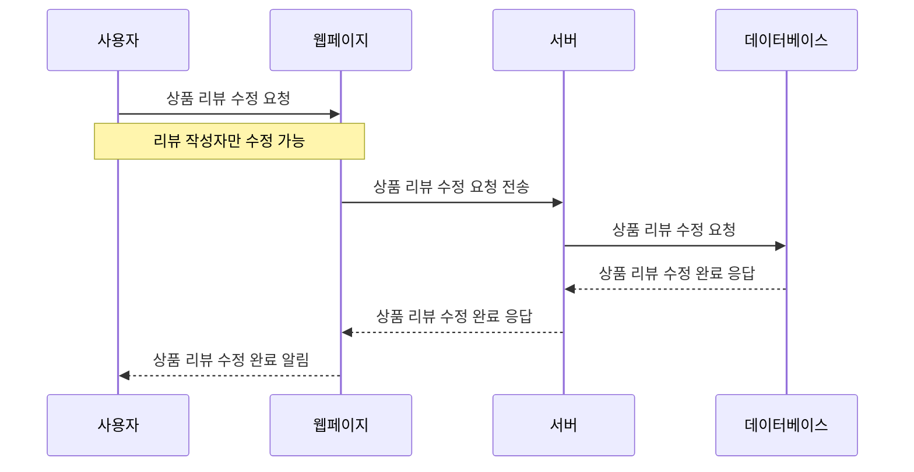

# 요구사항 3번) 상품 리뷰 수정

1. 사용자는 다른 사용자의 리뷰를 조회할 수 있다.
    - 상품의 평점은 사용자의 전체 평점을 평균을 내고 소숫점 첫 자리까지 표시

```mermaid
sequenceDiagram
    participant User as 사용자
    participant WebPage as 웹페이지
    participant Server as 서버
    participant Database as 데이터베이스
    
    User ->> WebPage: 상품 리뷰 수정 요청
    Note over User, WebPage: 리뷰 작성자만 수정 가능
    WebPage ->> Server: 상품 리뷰 수정 요청 전송
    Server ->> Database: 상품 리뷰 수정 요청
    Database -->> Server: 상품 리뷰 수정 완료 응답
    Server -->> WebPage: 상품 리뷰 수정 완료 응답
    WebPage -->> User: 상품 리뷰 수정 완료 알림

```