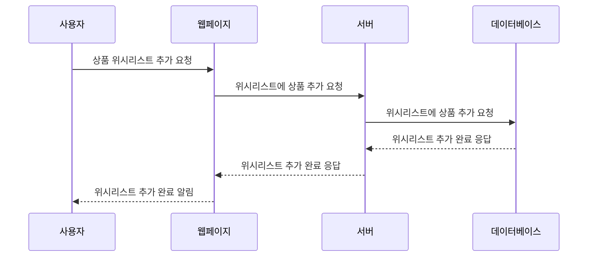

# 요구사항 1번) 위시리스트에 상품 추가

1. 사용자가 상품을 위시리스트에 추가 가능

```mermaid
sequenceDiagram
    participant User as 사용자
    participant WebPage as 웹페이지
    participant Server as 서버
    participant Database as 데이터베이스
    
    User ->> WebPage: 상품 위시리스트 추가 요청
    WebPage ->> Server: 위시리스트에 상품 추가 요청
    Server ->> Database: 위시리스트에 상품 추가 요청
    Database -->> Server: 위시리스트 추가 완료 응답
    Server -->> WebPage: 위시리스트 추가 완료 응답
    WebPage -->> User: 위시리스트 추가 완료 알림

```