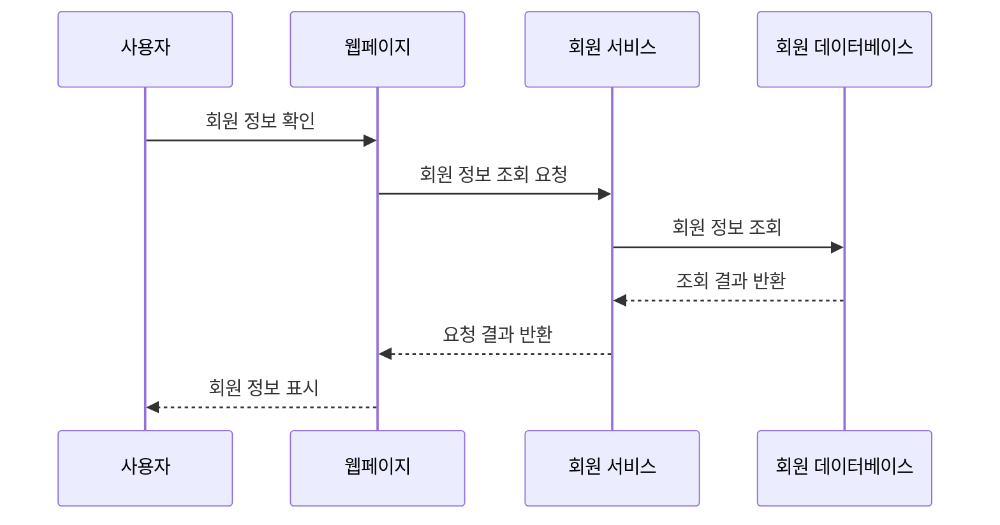

# 요구사항 1번) 회원의 기본 정보 조회

1. 회원의 기본 정보 조회 :
   - (사용자) 사원번호, 아이디(회사 이메일), 입사일
   - (관리자) 사원번호, 아이디(회사 이메일), 입사일, 유저 권한
   - 관리자는 비밀번호 조회 불가

```mermaid
sequenceDiagram
   participant User as 사용자 # 사용자, 관리자 모두 포함
   participant WebPage as 웹페이지
   participant UserService as 회원 서비스
   participant UserDatabase as 회원 데이터베이스

   User ->> WebPage: 회원 정보 확인
   WebPage ->> UserService: 회원 정보 조회 요청
   UserService ->> UserDatabase: 회원 정보 조회
   UserDatabase -->> UserService: 조회 결과 반환
   UserService -->> WebPage: 요청 결과 반환
   WebPage -->> User: 회원 정보 표시
```