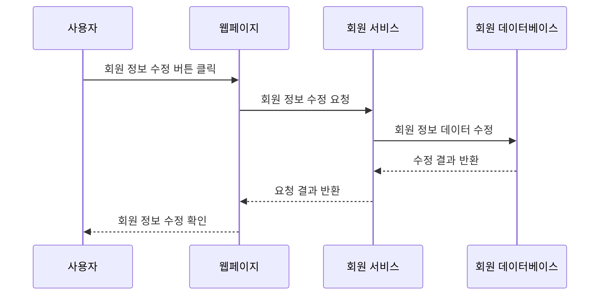

# 요구사항 3번) 회원의 기본 정보 수정

1. 회원의 기본 정보 수정
   - (사용자) 비밀번호

```mermaid
sequenceDiagram
   participant User as 사용자
   participant WebPage as 웹페이지
   participant UserService as 회원 서비스
   participant UserDatabase as 회원 데이터베이스

   User ->> WebPage: 회원 정보 수정 버튼 클릭
   WebPage ->> UserService: 회원 정보 수정 요청
   UserService ->> UserDatabase: 회원 정보 데이터 수정
   UserDatabase -->> UserService: 수정 결과 반환
   UserService -->> WebPage: 요청 결과 반환
   WebPage -->> User: 회원 정보 수정 확인
```