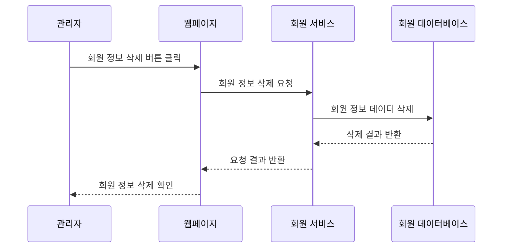

# 요구사항 4번) 회원의 기본 정보 삭제

1. 회원의 기본 정보 삭제
   - (사용자 및 관리자)

```mermaid
sequenceDiagram
   participant Admin as 관리자
   participant WebPage as 웹페이지
   participant UserService as 회원 서비스
   participant UserDatabase as 회원 데이터베이스

   Admin ->> WebPage: 회원 정보 삭제 버튼 클릭
   WebPage ->> UserService: 회원 정보 삭제 요청
   UserService ->> UserDatabase: 회원 정보 데이터 삭제
   UserDatabase -->> UserService: 삭제 결과 반환
   UserService -->> WebPage: 요청 결과 반환
   WebPage -->> Admin: 회원 정보 삭제 확인
```