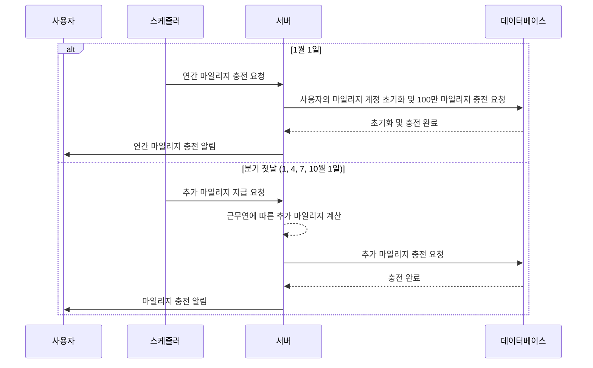

# 요구사항 1번) 마일리지 자동 충전

1. 연간 사원 마일리지를 1월 1일에 100만 마일리지씩 자동 충전
    - 입사일 기준으로 연차*1만 마일리지를 분기마다(1, 4, 7, 10월 1일) 추가로 지급한다.
    - 1마일리지 = 1원
    - 연간 충전되는 마일리지는 내년으로 이월되지 않음, 수동으로 충전한 마일리지는 유지

```mermaid
sequenceDiagram
    participant User as 사용자
    participant Scheduler as 스케줄러
    participant Server as 서버
    participant Database as 데이터베이스

    alt 1월 1일
        Scheduler ->> Server: 연간 마일리지 충전 요청
        Server ->> Database: 사용자의 마일리지 계정 초기화 및 100만 마일리지 충전 요청
        Database -->> Server: 초기화 및 충전 완료
        Server ->> User: 연간 마일리지 충전 알림

    else 분기 첫날 (1, 4, 7, 10월 1일)
        Scheduler ->> Server: 추가 마일리지 지급 요청
        Server -->> Server: 근무연에 따른 추가 마일리지 계산
        Server ->> Database: 추가 마일리지 충전 요청
        Database -->> Server: 충전 완료
        Server ->> User: 마일리지 충전 알림
    end

```