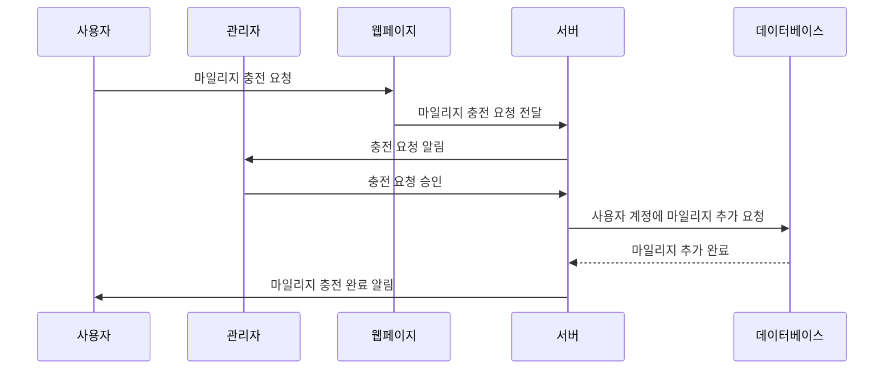

# 요구사항 2번) 마일리지 수동 충전

1. 사용자가 추가적인 충전을 원할 경우 충전 탭에서 별개로 마일리지 충전 요청 가능
2. 사용자가 별도로 충전한 마일리지와 연간 충전되는 마일리지는 별개로 취급
    - 연간 충전되는 마일리지는 내년으로 이월되지 않음, 수동으로 충전한 마일리지는 유지
    - 연간 충전되는 마일리지 먼저 사용, 해당 마일리지 소진 시 별도로 충전한 마일리지 사용
3. 사용자에게 충전 요청이 들어온 경우 승인을 통해 마일리지 추가 지급

