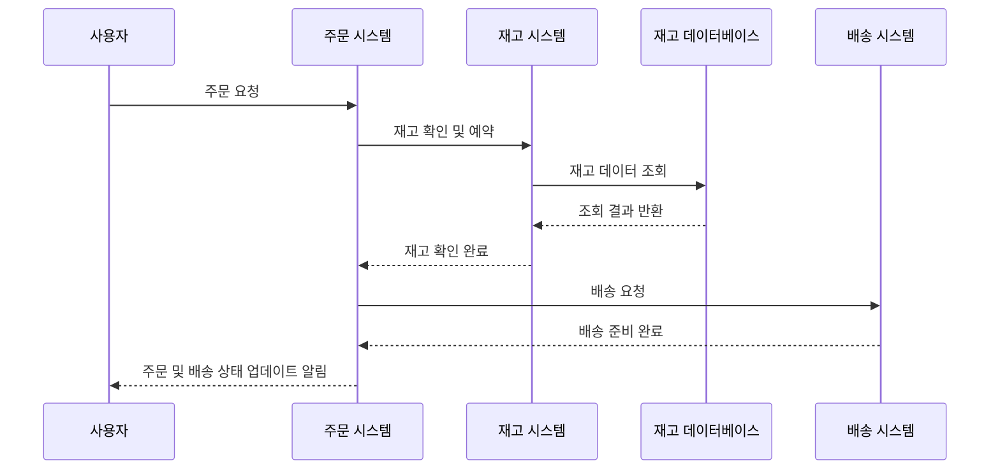

# 요구사항 1번) 상품 주문

1. 주문이 접수되면 신속하게 주문 처리 및 배송 프로세스를 진행하고 관리

```mermaid
sequenceDiagram
    participant User as 사용자
    participant OrderSystem as 주문 시스템
    participant InventorySystem as 재고 시스템
    participant InvenDatabase as 재고 데이터베이스
    participant ShippingSystem as 배송 시스템

    User ->> OrderSystem: 주문 요청
    OrderSystem ->> InventorySystem: 재고 확인 및 예약
    InventorySystem ->> InvenDatabase: 재고 데이터 조회
    InvenDatabase -->> InventorySystem: 조회 결과 반환
    InventorySystem -->> OrderSystem: 재고 확인 완료
    OrderSystem ->> ShippingSystem: 배송 요청
    ShippingSystem -->> OrderSystem: 배송 준비 완료
    OrderSystem -->> User: 주문 및 배송 상태 업데이트 알림
```