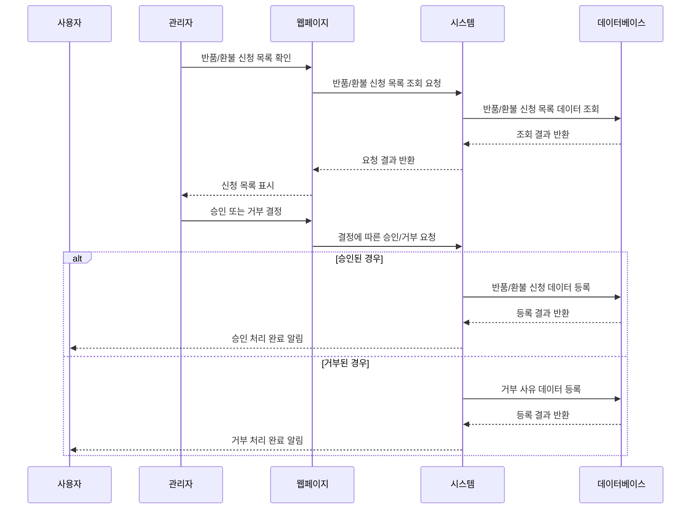

# 요구사항 3번) 반품/환불 수정

1. 반품/환불 승인 / 거부
    - 반품/환불 상태
        - 환불 처리 상태 : 환불 요청, 환불 완료
        - 반품 처리 상태 : 반품 요청, 반품중, 반품완료
2. 반품 및 환불 정책
    - 반품 시 수수료 10% 제외한다

```mermaid
sequenceDiagram
   participant User as 사용자
   participant Admin as 관리자
   participant WebPage as 웹페이지
   participant System as 시스템
   participant Database as 데이터베이스

   Admin ->> WebPage: 반품/환불 신청 목록 확인
   WebPage ->> System: 반품/환불 신청 목록 조회 요청
   System ->> Database: 반품/환불 신청 목록 데이터 조회
   Database -->> System: 조회 결과 반환
   System -->> WebPage: 요청 결과 반환
   WebPage -->> Admin: 신청 목록 표시
   Admin ->> WebPage: 승인 또는 거부 결정
   WebPage ->> System: 결정에 따른 승인/거부 요청

   alt 승인된 경우
      System ->> Database: 반품/환불 신청 데이터 등록
      Database -->> System: 등록 결과 반환
      System -->> User: 승인 처리 완료 알림
   else 거부된 경우
      System ->> Database: 거부 사유 데이터 등록
      Database -->> System: 등록 결과 반환
      System -->> User: 거부 처리 완료 알림
   end
```