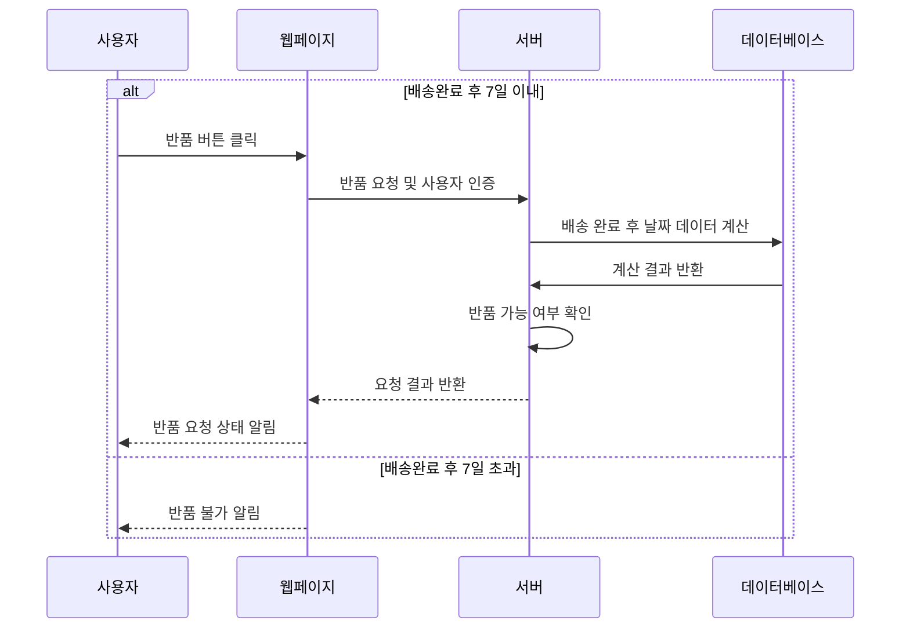

# 요구사항 4번) 상품 반품

1. 반품 요청
    - 반품 처리 상태 : 반품 요청, 반품중, 반품 완료
    - 상품 반품은 '배송 완료' 후 7일 이내

```mermaid
sequenceDiagram
   participant User as 사용자
   participant WebPage as 웹페이지
   participant Server as 서버
   participant Database as 데이터베이스

   alt 배송완료 후 7일 이내
      User ->> WebPage: 반품 버튼 클릭
      WebPage ->> Server: 반품 요청 및 사용자 인증
      Server ->> Database: 배송 완료 후 날짜 데이터 계산
      Database ->> Server: 계산 결과 반환
      Server ->> Server: 반품 가능 여부 확인
      Server -->> WebPage: 요청 결과 반환
      WebPage -->> User: 반품 요청 상태 알림

   else 배송완료 후 7일 초과
      WebPage -->> User: 반품 불가 알림
   end
```