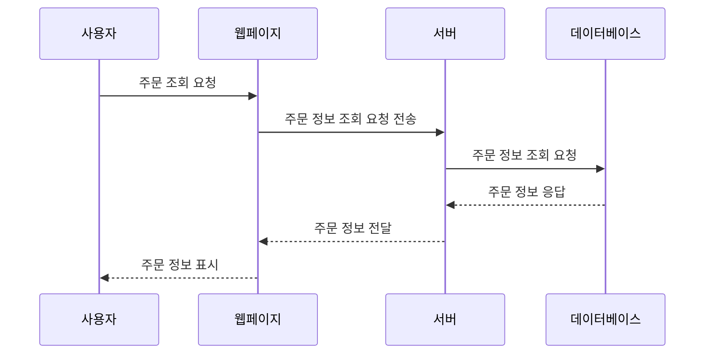

# 요구사항 7번) 주문 조회 및 추적

1. 주문한 상품을 언제든지 조회하고 배송 상태를 실시간으로 추적할 수 있는 정보 제공
    - 관리자가 직접 주문 상태값 변경해서 사용자에게 주문 조회/추적 정보 제공

```mermaid
sequenceDiagram
    participant User as 사용자
    participant WebPage as 웹페이지
    participant Server as 서버
    participant Database as 데이터베이스
    User ->> WebPage: 주문 조회 요청
    WebPage ->> Server: 주문 정보 조회 요청 전송
    Server ->> Database: 주문 정보 조회 요청
    Database -->> Server: 주문 정보 응답
    Server -->> WebPage: 주문 정보 전달
    WebPage -->> User: 주문 정보 표시

```