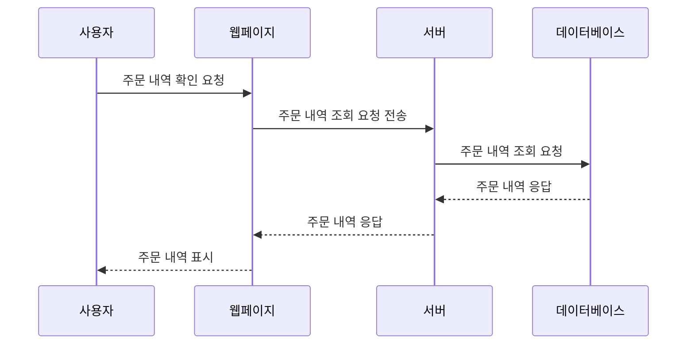

# 요구사항 8번) 이전 주문 상품 조회

1. 이전에 주문한 상품들에 대한 정보 확인
    - 주문 내역 확인
    - 처리 상태 : 결제완료, 배송요청, 배송준비중, 배송중, 배송완료

```mermaid
sequenceDiagram
    participant User as 사용자
    participant WebPage as 웹페이지
    participant Server as 서버
    participant Database as 데이터베이스
    
    User ->> WebPage: 주문 내역 확인 요청
    WebPage ->> Server: 주문 내역 조회 요청 전송
    Server ->> Database: 주문 내역 조회 요청
    Database -->> Server: 주문 내역 응답
    Server -->> WebPage: 주문 내역 응답
    WebPage -->> User: 주문 내역 표시

```