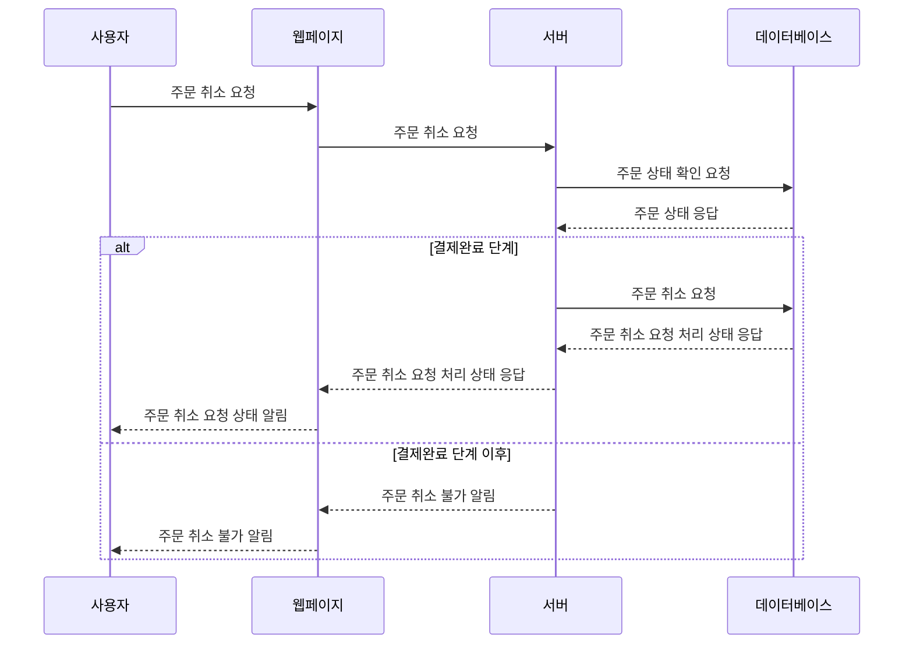

# 요구사항 9번) 주문 취소

1. 주문 취소
    - 주문 취소 처리 상태 : 취소 요청, 취소 완료
    - 주문 취소는 '결제완료' 단계에서만 가능

```mermaid
sequenceDiagram
    participant User as 사용자
    participant WebPage as 웹페이지
    participant Server as 서버
    participant Database as 데이터베이스
    
    User ->> WebPage: 주문 취소 요청
    WebPage ->> Server: 주문 취소 요청
    Server ->> Database: 주문 상태 확인 요청
    Database -->> Server: 주문 상태 응답

    alt 결제완료 단계
        Server ->> Database: 주문 취소 요청
        Database -->> Server: 주문 취소 요청 처리 상태 응답
        Server -->> WebPage: 주문 취소 요청 처리 상태 응답
        WebPage -->> User: 주문 취소 요청 상태 알림

    else 결제완료 단계 이후
        Server -->> WebPage: 주문 취소 불가 알림
        WebPage -->> User: 주문 취소 불가 알림
    end

```