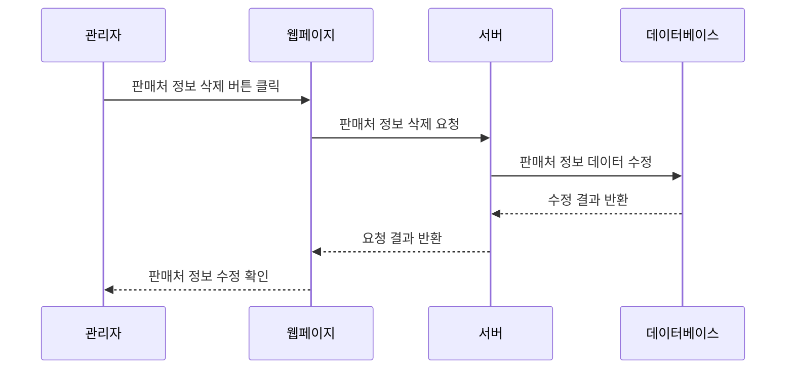

# 요구사항 4번) 판매처 삭제

판매처 관리를 위한 판매처 삭제 기능 추가.
판매처 정보에는 판매처 이름, 담당자명, 판매자 연락처에 대한 정보가 들어감.

```mermaid
sequenceDiagram
    participant Admin as 관리자
    participant WebPage as 웹페이지
    participant Server as 서버
    participant Database as 데이터베이스

    Admin ->> WebPage: 판매처 정보 삭제 버튼 클릭
    WebPage ->> Server: 판매처 정보 삭제 요청
    Server ->> Database: 판매처 정보 데이터 수정
    Database -->> Server: 수정 결과 반환
    Server -->> WebPage: 요청 결과 반환
    WebPage -->> Admin: 판매처 정보 수정 확인
```
