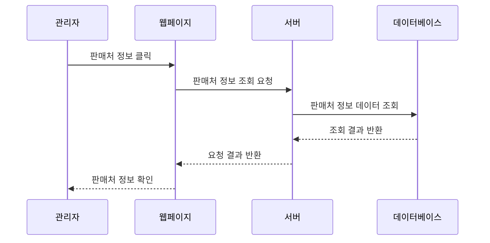

# 요구사항 2번) 판매처 조회

판매처 관리를 위한 판매처 리스트 기능 추가.

```mermaid
sequenceDiagram
    participant Admin as 관리자
    participant WebPage as 웹페이지
    participant Server as 서버
    participant Database as 데이터베이스

    Admin ->> WebPage: 판매처 정보 클릭
    WebPage ->> Server: 판매처 정보 조회 요청
    Server ->> Database: 판매처 정보 데이터 조회
    Database -->> Server: 조회 결과 반환
    Server -->> WebPage: 요청 결과 반환
    WebPage -->> Admin: 판매처 정보 확인
```
