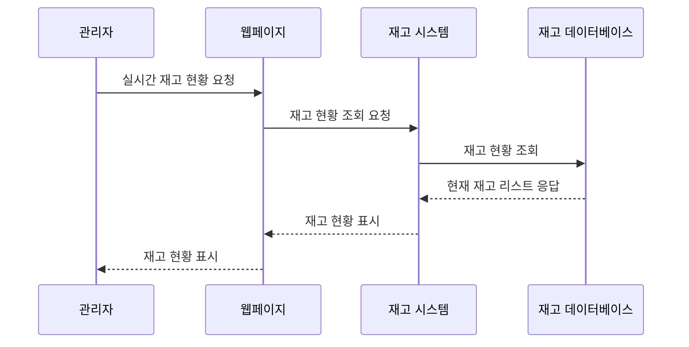

# 요구사항 2번) 재고 현황 조회

1. 실시간 재고 현황을 리스트로 확인. 관리자는 상품 ID로 재고를 확인할 상품 검색 가능.
    - 상품 ID뿐만 아니라 상품명으로도 상품을 검색할 수 있다.

```mermaid
sequenceDiagram
   participant Admin as 관리자
   participant WebPage as 웹페이지
   participant StockSystem as 재고 시스템
   participant StockDatabase as 재고 데이터베이스

   Admin ->> WebPage: 실시간 재고 현황 요청
   WebPage ->> StockSystem: 재고 현황 조회 요청
   StockSystem ->> StockDatabase: 재고 현황 조회
   StockDatabase -->> StockSystem: 현재 재고 리스트 응답
   StockSystem -->> WebPage: 재고 현황 표시
   WebPage -->> Admin: 재고 현황 표시

```