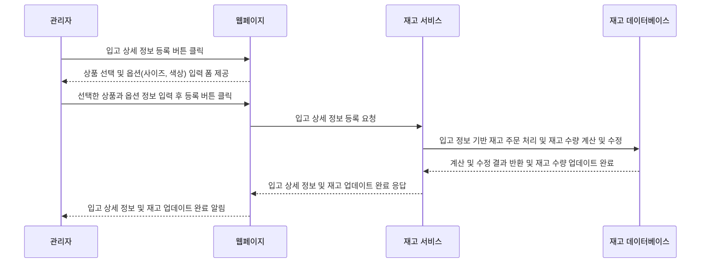
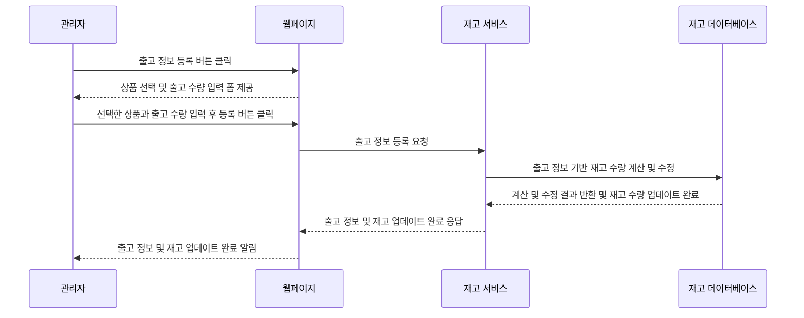

# 요구사항 1번) 재고 입고 및 출고 프로세스

1. 입고 상세 정보 등록
    - 상품을 선택하여 옵션을(사이즈, 색상) 지정하여 재고 주문 -> 사입
2. 재고 수량 자동 업데이트

```mermaid
sequenceDiagram
    participant Admin as 관리자
    participant WebPage as 웹페이지
    participant StockService as 재고 서비스
    participant StockDatabase as 재고 데이터베이스
    
    Admin ->> WebPage: 입고 상세 정보 등록 버튼 클릭
    WebPage -->> Admin: 상품 선택 및 옵션(사이즈, 색상) 입력 폼 제공
    Admin ->> WebPage: 선택한 상품과 옵션 정보 입력 후 등록 버튼 클릭
    WebPage ->> StockService: 입고 상세 정보 등록 요청
    StockService ->> StockDatabase: 입고 정보 기반 재고 주문 처리 및 재고 수량 계산 및 수정
    StockDatabase -->> StockService: 계산 및 수정 결과 반환 및 재고 수량 업데이트 완료
    StockService -->> WebPage: 입고 상세 정보 및 재고 업데이트 완료 응답
    WebPage -->> Admin: 입고 상세 정보 및 재고 업데이트 완료 알림

```

```mermaid
sequenceDiagram
    participant Admin as 관리자
    participant WebPage as 웹페이지
    participant StockService as 재고 서비스
    participant StockDatabase as 재고 데이터베이스
    
    Admin ->> WebPage: 출고 정보 등록 버튼 클릭
    WebPage -->> Admin: 상품 선택 및 출고 수량 입력 폼 제공
    Admin ->> WebPage: 선택한 상품과 출고 수량 입력 후 등록 버튼 클릭
    WebPage ->> StockService: 출고 정보 등록 요청
    StockService ->> StockDatabase: 출고 정보 기반 재고 수량 계산 및 수정
    StockDatabase -->> StockService: 계산 및 수정 결과 반환 및 재고 수량 업데이트 완료
    StockService -->> WebPage: 출고 정보 및 재고 업데이트 완료 응답
    WebPage -->> Admin: 출고 정보 및 재고 업데이트 완료 알림

```