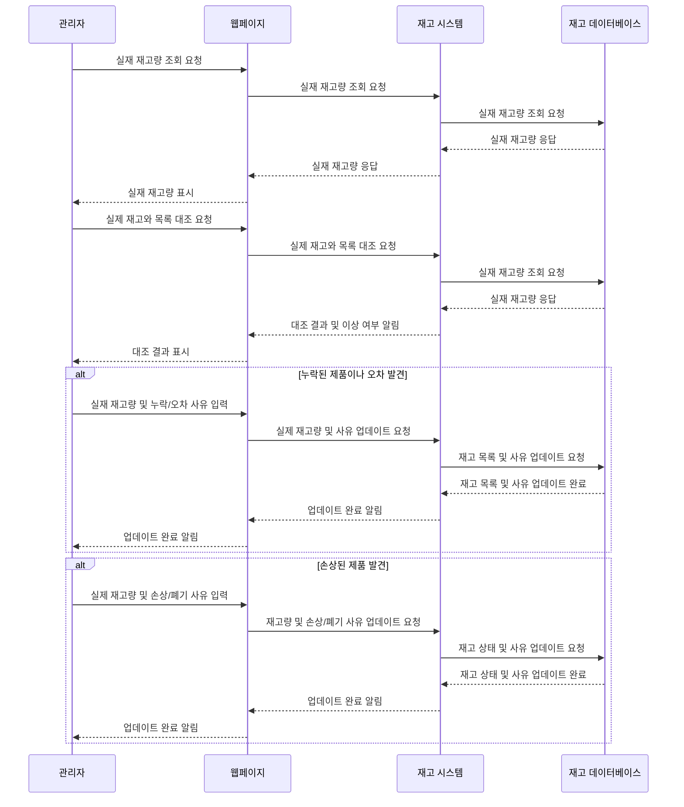

# 요구사항 3번) 재고 검수

1. 재고 검수
    - 재고 목록과 실제로 창고에 있는 제품을 대조하여 누락된 제품이나 오차 확인
    - 손상된 제품은 정리하거나 폐기
    - 누락, 폐기 사유 추가

```mermaid
sequenceDiagram
    participant Admin as 관리자
    participant WebPage as 웹페이지
    participant StockSystem as 재고 시스템
    participant StockDatabase as 재고 데이터베이스
    
    Admin ->> WebPage: 실재 재고량 조회 요청
    WebPage ->> StockSystem: 실재 재고량 조회 요청
    StockSystem ->> StockDatabase: 실재 재고량 조회 요청
    StockDatabase -->> StockSystem: 실재 재고량 응답
    StockSystem -->> WebPage: 실재 재고량 응답
    WebPage -->> Admin: 실재 재고량 표시
    Admin ->> WebPage: 실제 재고와 목록 대조 요청
    WebPage ->> StockSystem: 실제 재고와 목록 대조 요청
    StockSystem ->> StockDatabase: 실재 재고량 조회 요청
    StockDatabase -->> StockSystem: 실재 재고량 응답
    StockSystem -->> WebPage: 대조 결과 및 이상 여부 알림
    WebPage -->> Admin: 대조 결과 표시

   alt 누락된 제품이나 오차 발견
      Admin ->> WebPage: 실재 재고량 및 누락/오차 사유 입력
      WebPage ->> StockSystem: 실제 재고량 및 사유 업데이트 요청
      StockSystem ->> StockDatabase: 재고 목록 및 사유 업데이트 요청
      StockDatabase -->> StockSystem: 재고 목록 및 사유 업데이트 완료
      StockSystem -->> WebPage: 업데이트 완료 알림
      WebPage -->> Admin: 업데이트 완료 알림
   end

   alt 손상된 제품 발견
      Admin ->> WebPage: 실제 재고량 및 손상/폐기 사유 입력
      WebPage ->> StockSystem: 재고량 및 손상/폐기 사유 업데이트 요청
      StockSystem ->> StockDatabase: 재고 상태 및 사유 업데이트 요청
      StockDatabase -->> StockSystem: 재고 상태 및 사유 업데이트 완료
      StockSystem -->> WebPage: 업데이트 완료 알림
      WebPage -->> Admin: 업데이트 완료 알림
   end

```