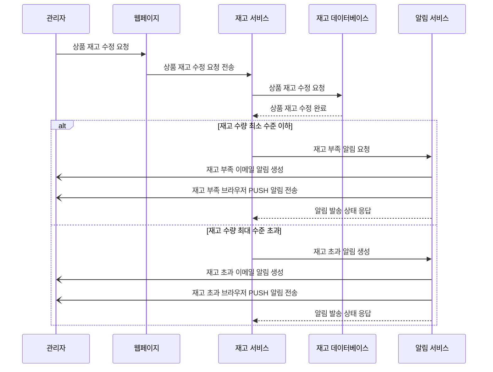

# 요구사항 4번) 재고 이상 알림

1. 재고 이상 알림
    - 알림 방식은 관리자 이메일과 브라우저 PUSH 알림
    - 재고 부족 알림: 재고 수량이 최소 수준으로 떨어질 경우 관리자에게 자동으로 알림 전송
    - 재고 초과 알림: 재고 수량이 최대 수준을 초과할 경우 관리자에게 알림 전송
        - 관리자가 상품 등록 및 수정에서 최대/최소 수준 지정 가능

